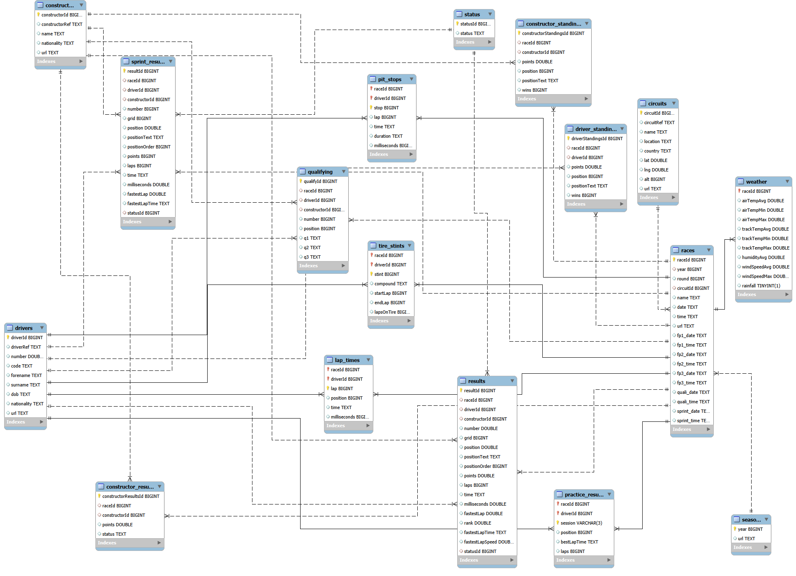
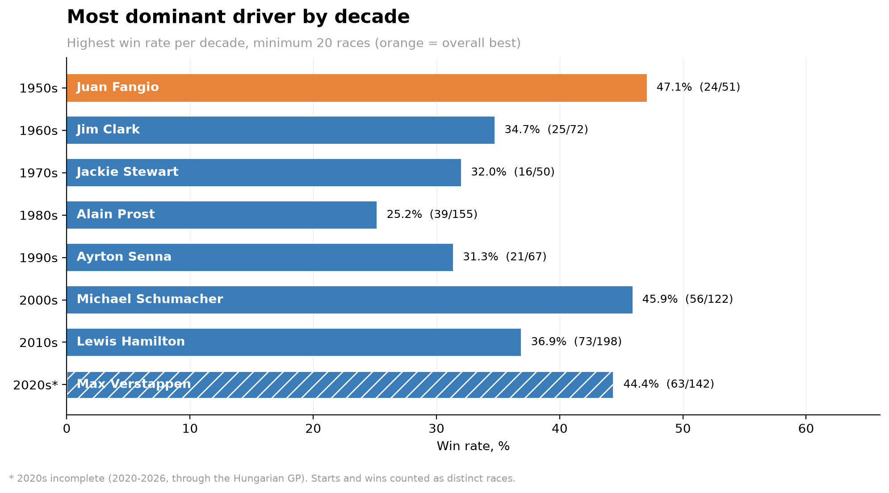
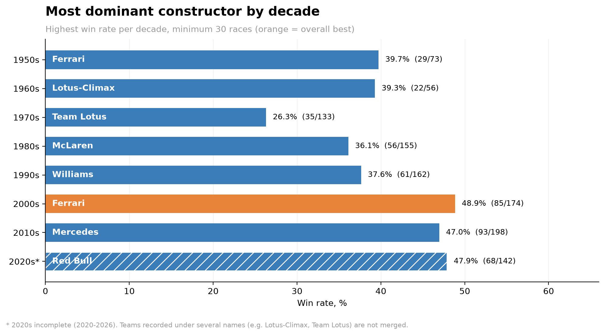
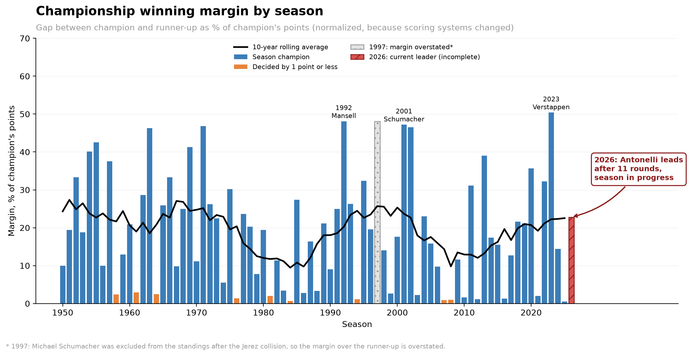
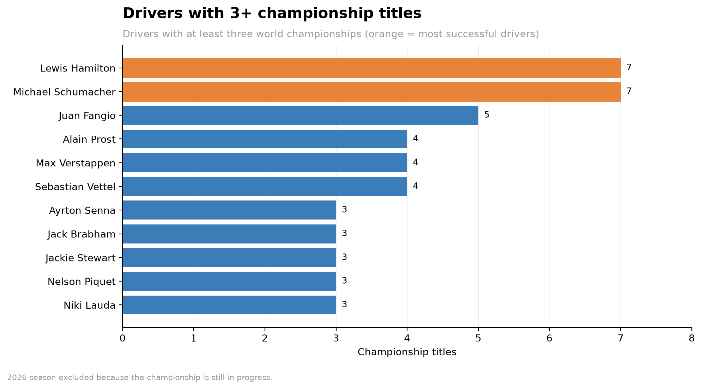

# Formula 1 SQL Analytics Project

SQL analysis of Formula 1 history (1950-2026) in MySQL 8: window functions, CTEs, views, and Python charts.

## Dataset

[Formula 1 World Championship (1950-2026)](https://github.com/Arths17/f1-dataset) by Atharv Ranjan, an extension of the Ergast database updated via the Jolpica API (CC0 license). 17 related tables: races, results, drivers, constructors, qualifying, pit stops, standings, and 2025-2026 extras (tire stints, weather, practice).

The CSV files are not included in this repository. Download them from the link above and place them in `data/`.



## Research Questions

| # | Question | Status |
|---|---|---|
| 1 | Most dominant drivers by decade | Done |
| 2 | Constructor dominance by decade | Done |
| 3 | Season champions and title margins | Done |
| 4 | Impact of pole position | Done |
| 5 | Position gainers | In progress |
| 6 | Pit stop evolution | Planned |
| 7 | Reliability trends | Planned |
| 8 | Tire strategy effectiveness (2025-2026) | Planned |

## Key Findings

### Q1: Most dominant drivers by decade


- Juan Fangio in the 1950s has the highest decade win rate (47.1%), ahead of Michael Schumacher in the 2000s (45.9%) and Max Verstappen in the 2020s (44.4%, decade incomplete).
- Lewis Hamilton is the only driver in the top three of three different decades.
- Win rate favors short, strong careers, so a minimum of 20 starts is applied.

### Q2: Constructor dominance by decade


- Ferrari in the 2000s (48.9%), Red Bull in the 2020s (47.9%, incomplete) and Mercedes in the 2010s (47.0%) are the most dominant constructor-decades.
- The 1970s were the most competitive era: Team Lotus (26.3%) and Ferrari (26.2%) are effectively tied.

### Q3: Season champions and title margins



- Eleven drivers have won three or more titles; Hamilton and Schumacher lead with seven each.
- Nine championships were decided by one point or less; the closest was Lauda over Prost in 1984 (half a point).
- Normalized by the champion's points, margins show no steady trend but cycles.

### Q4: Impact of pole position


- The pole-sitter's win rate fell to 28% in the 1980s, then rose to about 50% in the 2000s-2010s and 56% in the 2020s (incomplete).
- Starters from P11 or lower never won more than 0.33% of races in any decade.
- These figures show association, not cause: dominant cars tend to take both pole and the win.

Full findings and caveats for each question are in [`docs/notes.md`](docs/notes.md).

## Data Notes

- The 2026 season is incomplete (through the Hungarian Grand Prix, round 11); it is excluded or marked in year-by-year comparisons.
- Early seasons contain shared cars (a driver taking over a teammate's car mid-race), so starts and wins are counted as distinct races rather than result rows.
- Some teams appear under several constructor names (e.g. Lotus-Climax, Lotus-Ford); they are not merged because identical names can refer to unrelated teams.
- In 1997 Michael Schumacher is absent from the final standings (excluded after the Jerez collision), which inflates Villeneuve's margin.

## How to Reproduce

1. Download the dataset and put the CSV files into `data/`.
2. Install dependencies: `pip install -r requirements.txt`
3. Copy `.env.example` to `.env` and fill in your MySQL credentials.
4. Create the database: run `sql/00_create_database.sql` in MySQL (8.0+ required for window functions and CTEs).
5. Load the data: `python scripts/load_data.py`
6. Add keys and views: run `sql/01_primary_keys.sql`, `sql/02_foreign_keys.sql`, `sql/03_views.sql` in that order.
7. Run the queries from `sql/analysis/`. Charts are built in `notebooks/analysis.ipynb`.

## Project Structure

```
f1-analysis/
├── data/          # CSV files (not tracked)
├── docs/          # ER diagram, notes
├── sql/           # database setup and analysis queries
│   └── analysis/  # one file per research question
├── scripts/       # data loading
├── notebooks/     # charts
├── results/       # query outputs (CSV)
└── charts/        # images used in this README
```

## Tech Stack

MySQL 8, SQL (CTEs, window functions, views), Python, pandas, SQLAlchemy, matplotlib, Jupyter.