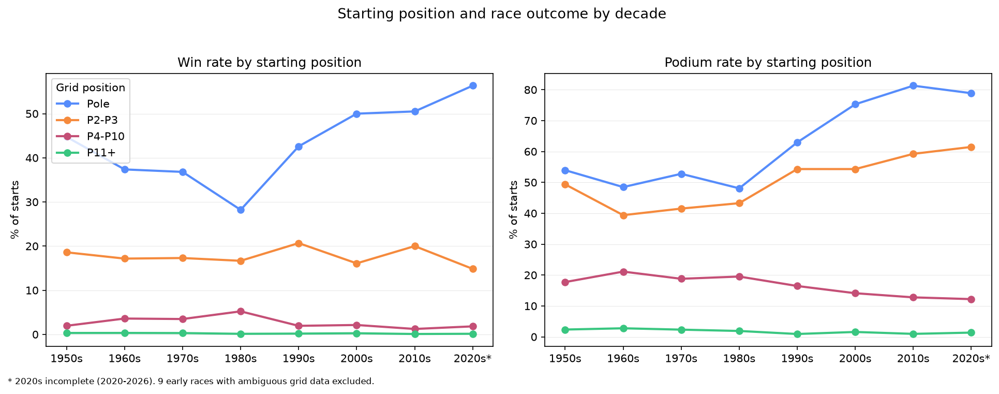

## Q1 Findings

Juan Fangio in the 1950s (47.1% win rate) achieved the highest decade-level win rate in the dataset, narrowly ahead of Michael Schumacher in the 2000s (45.9%) and Max Verstappen in the 2020s (44.4%, decade still incomplete).

The 1980s appear to have been one of the most competitive eras. Alain Prost led the decade with a win rate of only 25.2%, the lowest among all decade leaders, suggesting that victories were shared among several elite drivers.

Lewis Hamilton is the only driver to appear in the top three across three different decades (2000s, 2010s, 2020s).

Win rate favors short, strong careers: Ayrton Senna leads the 1990s with only 67 starts, ahead of Schumacher (128 starts). Small samples can also push newcomers into the top three, such as Andrea Kimi Antonelli in the 2020s (17.1% in 35 starts), which is why a minimum of 20 starts is applied.

### Data Caveat

Starts and wins are counted as distinct races rather than result rows, because in the early seasons drivers sometimes took over a teammate's car mid-race and appear in several rows for the same race.

## Q2 Findings

Ferrari in the 2000s (48.9%), Red Bull in the 2020s (47.9%, decade incomplete) and Mercedes in the 2010s (47.0%) are the most dominant constructor-decades.

The 1970s were the most competitive era: Team Lotus (26.3%) and Ferrari (26.2%) are effectively tied, and Ferrari actually won more races (37 vs 35).

Caveat: the dataset records some teams under several constructor names (e.g. Lotus-Climax and Lotus-Ford in the 1960s), so their results are split across entries, and I deliberately did not merge them because names like "Lotus" and "Renault" refer to unrelated teams in different eras.

## Q3 Findings

Eleven drivers have won three or more titles; Hamilton and Schumacher lead with seven each, followed by Fangio with five.

Nine championships were decided by a single point or less, the closest being Lauda over Prost in 1984 (half a point).

Normalized by the champion's points, the winning margin shows no steady trend but cycles: the 10-year average dips to about 10% in the mid-1980s and around 2008-2010 and recovers to 20%+ in other periods.

The largest margin belongs to Verstappen in 2023 (about 50%).

### Data Caveat

Margins are computed from the final standings in the dataset.

In 1997, Michael Schumacher was excluded from the championship after the Jerez collision, so his points do not appear in the final standings. As a result, Jacques Villeneuve's championship margin appears much larger than the actual title battle.

Point systems and historical scoring rules also changed over time, which is why margins are normalized as a percentage of the champion's points.

## Q4: Pole position advantage

| Decade | Poles | Wins from pole | Win rate | Podium rate |
|---|---|---|---|---|
| 1950s | 76 | 34 | 44.7% | 54.0% |
| 1960s | 99 | 37 | 37.4% | 48.5% |
| 1970s | 144 | 53 | 36.8% | 52.8% |
| 1980s | 156 | 44 | 28.2% | 48.1% |
| 1990s | 162 | 69 | 42.6% | 63.0% |
| 2000s | 174 | 87 | 50.0% | 75.3% |
| 2010s | 198 | 100 | 50.5% | 81.3% |
| 2020s\* | 142 | 80 | 56.3% | 78.9% |

\* 2020s incomplete (2020-2026).

## Q4 Findings

The pole-sitter's win rate fell from 44.7% in the 1950s to a low of 28.2% in the 1980s, then climbed to about 50% in the 2000s and 2010s and to 56.3% in the 2020s (decade still incomplete).

Drivers starting P2-P3 won 15-21% of their races in every decade, so the edge of pole over the next row grew from about 1.7x in the 1980s to about 3.8x in the 2020s.

Winning from the middle of the grid was most common in the 1960s-1980s: P4-P10 starters won 3.5-5.2% of races, compared with roughly 1-2% in the 1950s and since the 1990s. Starters from P11 or lower never won more than 0.33% of races in any decade.

These figures show association, not cause. The fastest car typically takes pole and also wins, so a higher pole win rate may reflect dominant teams (e.g. Mercedes, Red Bull) rather than a stronger effect of the pole position itself.

### Data Caveat

Nine early races (1951-1964) were excluded because several drivers are recorded on grid position 1 (shared cars). A few 1950s races also have shared wins, which can count one race win twice in the grid-group table. `grid` is the starting grid, which can differ from the qualifying result because of grid penalties. Pit-lane starts (`grid = 0`) are excluded.